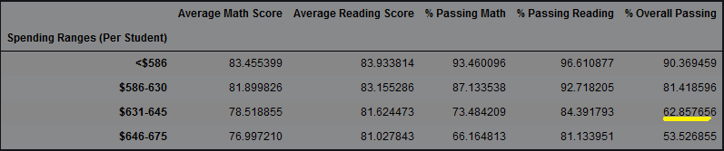

# School_District_Analysis

## Project Overview
- A high-level snapshot of the district's key metrics, presented in a table format
- An overview of the key metrics for each school, presented in a table format
- Tables presenting each of the following metrics:
        - Top 5 and bottom 5 performing schools, based on the overall passing rate
        - The average math score received by students in each grade level at each school
        - The average reading score received by students in each grade level at each school
        - School performance based on the budget per student
        - School performance based on the school size
        - School performance based on the type of school

## Results
By removing the 9th grade reading and math results for Thomas High School, the following metrics were altered:
  1. The district summary decreased across both math and reading scores.
  2. The school summary reflects the dramatic drop in values with the removal of the 9th graders' scores. Overall passing went from 90.9% to roughly 65.1%
  3. While removing the 9th graders' scores takes Thomas High out of the top 5 performing schools, its scores are still not low enough to place it in the bottom 5 of performing schools.
  4. By replacing the 9th grade scores with Nan, other key metrics were impacted
    - Math and reading scores were unaffected for the other grades at Thomas High School
    - Scores by School Spending changed slightly, but not substantially

    - Values in the 'Medium' category were slightly impacted when sorted by size
    
    

    - When organized by school type, the "Charter" school category was slightly impacted
    
## Summary
By replacing 9th grade data with Nan, the district summary was slightly altered along the following 4 data points:

Essentially, the 461 of the 39,170 students were 9th graders at Thomas High comprised of barely more than 1% of the total student body, and the alteration to their data had a small impact overall.
